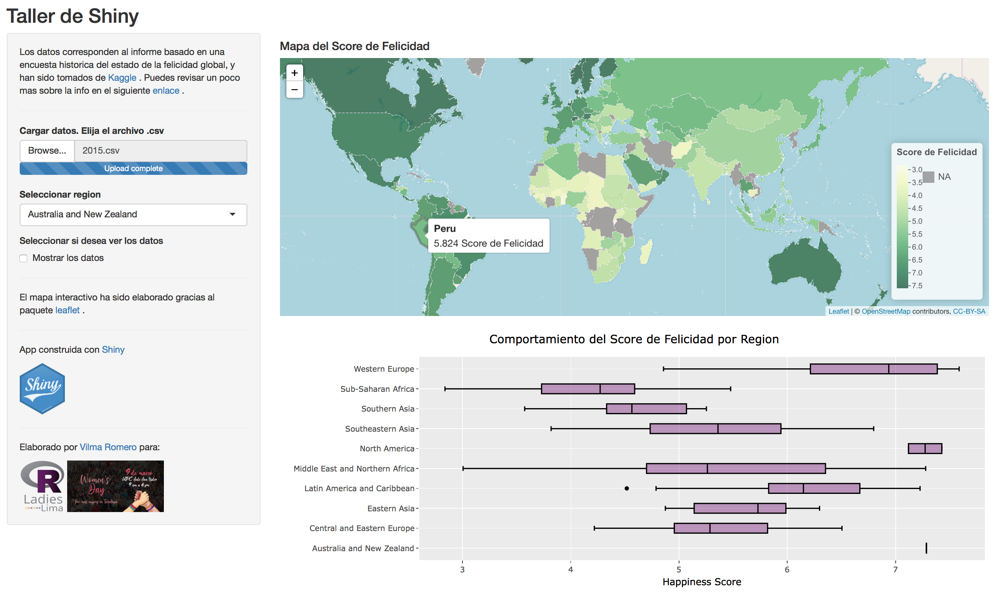

Este taller tiene como objetivo introducir a los participantes el uso del paquete [**`shiny`**](https://shiny.rstudio.com). Este paquete permite construir de manera sencilla aplicaciones web interactivas directamente desde R. Además, gracias a que la elaboración se realiza completamente desde R, se tiene la ventaja de que los usuarios no sólo puedan interactuar con los datos sino también con sus respectivos análisis.

Al finalizar este taller y utilizando los datos de la encuesta histórica del estado de la felicidad global tomados de la [plataforma Kaggle](https://www.kaggle.com/unsdsn/world-happiness), habremos construido lo siguiente:

El despliegue de esta aplicación se encuentra en <https://vilsurr.shinyapps.io/tallershinywomensday/>. Es importante mencionar que para que los resultados se vean como la imagen anterior, hay que cargar alguno de los archivos *.csv* que se encuentran en la carpeta **"world-happiness-report"** del [repositorio del taller](https://github.com/VilmaRomero/TallerShiny-WomensDay).

