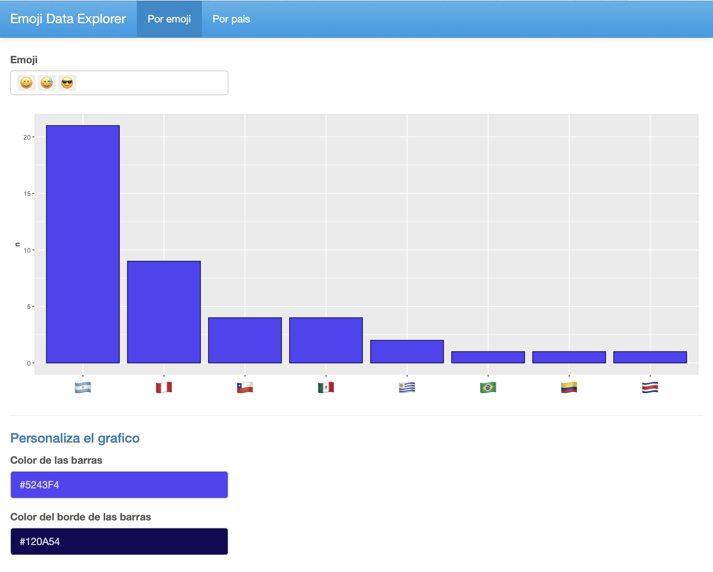

Taller a cargo de [**Florencia D'Andrea**](https://florencia.netlify.app), [**Juan Cruz Rodríguez**](https://jcrodriguez.rbind.io) y [**Vilma Romero**](https://vilmaromero.github.io)

**Sobre el taller**

¿Quieres generar una página web interactiva a partir de tu código de R? Con el paquete [**`Shiny`**](https://shiny.rstudio.com), resulta sencillo tomar tu trabajo en R y exponerlo a través de un navegador web para que cualquiera pueda usarlo.

En este taller inicial desarrollaremos una Shiny app de principio a fin. Te acompañaremos para que puedas generar la interfaz de usuario y el código del servidor. Brindaremos a la par algunas prácticas y tips al momento de su construcción así como recomendaciones de paquetes que pueden mejorar sustancialmente la app. Para finalizar te mostraremos formas gratuitas en las que podrás compartir la misma.

Al finalizar el taller, habremos construido la siguiente app:

- **Fecha:** Martes 29/09 | 18:00 a 20:00 horas
- **Lugar:** Online
